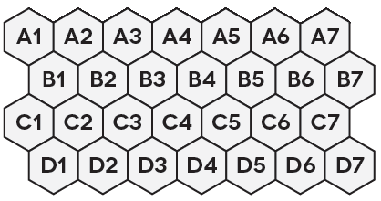

# TFT Positioning

## Introduction

This page is intended to summarise the TFT Set 9 Positioning guide made by Garchompro on [Youtube](https://www.youtube.com/watch?v=9GobCZryBuc).  
**All credits go to the author**, I just wanted to make it easily searchable for when I'm playing my games. I'll be adding some of my own notes based on my own playing experience.  

Please note that the positions suggested are 'default' positions which don't take into account how enemies place their units. Make sure you always scout enemy boards and adjust accordingly.  

The default positioning indcations are based on the following diagram:  

## Table of Contents
- [TFT Positioning](#tft-positioning)
  - [Introduction](#introduction)
  - [Table of Contents](#table-of-contents)
  - [General Guidance](#general-guidance)
  - [1 cost units](#1-cost-units)
    - [Cassiopeia](#cassiopeia)
    - [Cho'Gath](#chogath)
    - [Irelia](#irelia)
    - [Jhin](#jhin)
    - [Kayle](#kayle)
    - [Malzahar](#malzahar)
    - [Maokai](#maokai)
    - [Orianna](#orianna)
    - [Poppy](#poppy)
    - [Renekton](#renekton)
    - [Samira](#samira)
    - [Tristana](#tristana)
    - [Viego](#viego)
  - [2 cost units](#2-cost-units)
    - [Ashe](#ashe)
    - [Galio](#galio)
    - [Jinx](#jinx)
    - [Kassadin](#kassadin)
    - [Kled](#kled)
    - [Sett](#sett)
    - [Soraka](#soraka)
    - [Swain](#swain)
    - [Taliyah](#taliyah)
    - [Teemo](#teemo)
    - [Vi](#vi)
    - [Warwick](#warwick)
    - [Zed](#zed)
  - [3 cost units](#3-cost-units)
    - [Akshan](#akshan)
    - [Darius](#darius)
    - [Ekko](#ekko)
    - [Garen](#garen)
    - [Jayce](#jayce)
    - [Kalista](#kalista)
    - [Karma](#karma)
    - [Katarina](#katarina)
    - [Lissandra](#lissandra)
    - [Rek'Sai](#reksai)
    - [Sona](#sona)
    - [Taric](#taric)
  - [4 cost units](#4-cost-units)
    - [Aphelios](#aphelios)
    - [Azir](#azir)
    - [Gwen](#gwen)
    - [Jarvan IV](#jarvan-iv)
    - [Kai'Sa](#kaisa)
    - [Lux](#lux)
    - [Nasus](#nasus)
    - [Sejuani](#sejuani)
    - [Shen](#shen)
    - [Urgot](#urgot)
    - [Yasuo](#yasuo)
    - [Zeri](#zeri)
  - [5 cost units](#5-cost-units)
    - [Aatrox](#aatrox)
    - [Ahri](#ahri)
    - [Bel'Veth](#belveth)
    - [Heimerdinger](#heimerdinger)
    - [K'Sante](#ksante)
    - [Ryze](#ryze)
    - [Senna](#senna)
    - [Sion](#sion)

## General Guidance

## 1 cost units

### Cassiopeia

Positions:  
Comments:

### Cho'Gath

Positions:  
Comments:

### Irelia

Positions:  
Comments:

### Jhin

Positions:  
Comments:

### Kayle

Positions:  
Comments:

### Malzahar

Positions:  
Comments:

### Maokai

Positions:  
Comments:

### Orianna

Positions:  
Comments:

### Poppy

Positions:  
Comments:

### Renekton

Positions:  
Comments:

### Samira

Positions:  
Comments:

### Tristana

Positions:  
Comments:

### Viego

Positions:  
Comments:

## 2 cost units

### Ashe

Positions:  
Comments:

### Galio

Positions:  
Comments:

### Jinx

Positions:  
Comments:

### Kassadin

Positions:  
Comments:

### Kled

Positions:  
Comments:

### Sett

Positions:  
Comments:

### Soraka

Positions:  
Comments:

### Swain

Positions:  
Comments:

### Taliyah

Positions:  
Comments:

### Teemo

Positions:  
Comments:

### Vi

Positions:  
Comments:

### Warwick

Positions:  
Comments:

### Zed

Positions:  
Comments:

## 3 cost units

### Akshan

Positions:  
Comments:

### Darius

Positions:  
Comments:

### Ekko

Positions:  
Comments:

### Garen

Positions:  
Comments:

### Jayce

Positions:  
Comments:

### Kalista

Positions:  
Comments:

### Karma

Positions:  
Comments:

### Katarina

Positions:  
Comments:

### Lissandra

Positions:  
Comments:

### Rek'Sai

Positions:  
Comments:

### Sona

Positions:  
Comments:

### Taric

Positions:  
Comments:

## 4 cost units

### Aphelios

Positions:  
Comments:

### Azir

Positions:  
Comments:

### Gwen

Positions:  
Comments:

### Jarvan IV

Positions:  
Comments:

### Kai'Sa

Positions:  
Comments:

### Lux

Positions:  
Comments:

### Nasus

Positions:  
Comments:

### Sejuani

Positions:  
Comments:

### Shen

Positions:  
Comments:

### Urgot

Positions:  
Comments:

### Yasuo

Positions:  
Comments:

### Zeri

Positions:  
Comments:

## 5 cost units

### Aatrox

Positions:  
Comments:

### Ahri

Positions:  
Comments:

### Bel'Veth

Positions:  
Comments:

### Heimerdinger

Positions:  
Comments:

### K'Sante

Positions:  
Comments:

### Ryze

Positions:  
Comments:

### Senna

Positions:  
Comments:

### Sion

Positions:  
Comments:
